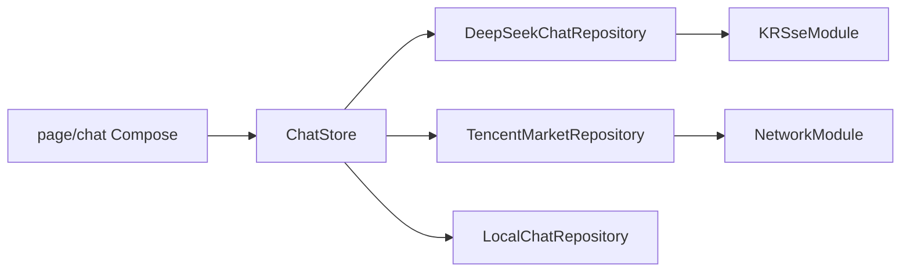

# StockApplication

Kuikly 跨端股票问答 App：用自然语言问行情、公司和投资概念，助手回复以 Markdown 流式展示，并附带腾讯接口的实时行情、分时 / 日 K。

默认页面路由：`stock_chat`。

> 内容由 AI 生成，仅供参考，**不构成投资建议**。行情来自腾讯网页接口，可能有延迟或失败。

## 功能

- 多轮问答，历史保存在本机
- DeepSeek Chat Completions（SSE 流式，失败回退一次 HTTP）
- 解析「目标股票 / 目标指数 / 相关标的」，展示行情卡、对比条、指数涨跌家数
- 底部详情抽屉：基础行情、分时 / 日 K、AI 摘要、继续问 AI
- 浅色 / 深色 / 跟随系统
- 可在设置中填写自定义 API Key（覆盖内置 Key）

## 技术栈

| 项 | 版本 / 说明 |
|----|-------------|
| UI | [Kuikly](https://github.com/Tencent-TDS/KuiklyUI) Compose DSL `2.7.0-2.1.21` |
| 语言 | Kotlin 2.1.21 / KMP |
| Markdown | `kuiklybase:markdown` 0.4.0 |
| Android | minSdk 23，compileSdk 34，AGP 7.4.2 |
| AI | `https://api.deepseek.com/chat/completions`（`deepseek-chat` / `deepseek-reasoner`） |
| 行情 | `qt.gtimg.cn` / `ifzq.gtimg.cn`（非官方） |

业务 UI 写在 `shared` 的 `com.tencent.kuikly.compose.*` 上，不要用 AndroidX Compose。

## 仓库结构

```
androidApp/     Android 宿主（KRBridgeModule / KRSseModule）
iosApp/         iOS 宿主
ohosApp/        鸿蒙宿主
h5App/          H5
miniApp/        微信小程序
shared/         跨端业务（问答页、行情、仓库）
buildSrc/       Kuikly 版本号等
```

`shared` 按包分层（不要为分层再拆 Gradle 模块）：

```
infra/          宿主桥、Page 基类、SSE
data/chat/      模型、解析、仓库（无 Compose）
state/chat/     ChatStore：页面状态与业务流程
page/chat/      @Page 与本页 Compose
component/      可复用主题、行情卡、抽屉行
```

更细的文件约定见 [`shared/src/commonMain/kotlin/com/hfad/stockapplication/component/README.md`](shared/src/commonMain/kotlin/com/hfad/stockapplication/component/README.md)。



## 环境要求

- JDK 17（Gradle 8.5）
- Android SDK（在 `local.properties` 里配置 `sdk.dir`）
- [DeepSeek API Key](https://platform.deepseek.com/)
- iOS：macOS、Xcode、CocoaPods，部署目标 iOS 14.1+
- 鸿蒙：DevEco Studio，使用 `settings.ohos.gradle.kts`

## 运行 Android

1. 克隆仓库后，在项目根目录创建 `local.properties`（已 gitignore，不要提交）：

```properties
sdk.dir=你的 Android SDK 路径
DEEPSEEK_API_KEY=sk-你的密钥
```

Windows 路径示例：`sdk.dir=C:\\Users\\你\\AppData\\Local\\Android\\Sdk`

2. 用 Android Studio 打开根工程，运行 `androidApp`。  
   或命令行：

```bash
./gradlew :androidApp:assembleDebug
```

Windows 用 `gradlew.bat`。Key 通过 `BuildConfig.DEEPSEEK_API_KEY` 注入页面参数 `deepseekApiKey`。未配置时仍可进设置手动填写。

## 其他端（概要）

| 端 | 说明 |
|----|------|
| iOS | `pod install`（`iosApp/Podfile` 引用 `../shared`），用 Xcode 打开 `iosApp` |
| 鸿蒙 | 以 `settings.ohos.gradle.kts` 打开，跑 `ohosApp` |
| H5 / 小程序 | Gradle 模块 `:h5App`、`:miniApp`，输出 JS 由对应宿主加载 |

各端需实现与 Android 对齐的 `HRBridgeModule`、`KRSseModule`。

## 安全

- **不要**把真实 API Key 提交到 Git
- 内置 Key 只应放在本机 `local.properties`
- 用户在设置里保存的 Key 只写本机 SharedPreferences

## License

未指定开源协议。Kuikly / DeepSeek / 腾讯行情各自遵循其条款。
