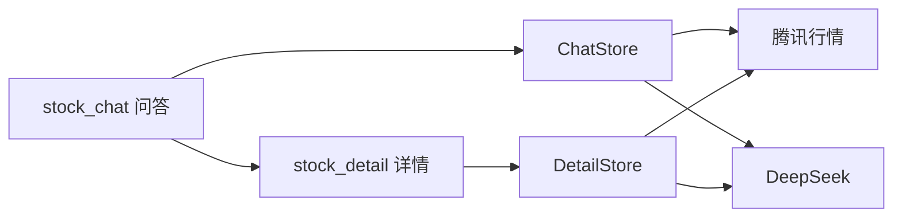

# StockApplication

Kuikly 跨端 **任务 2 · AI 股票问答** Demo。

用自然语言问 A 股、指数和投资概念；助手回复以 Markdown 流式展示，并附带腾讯公开接口的报价卡（含迷你走势）。点卡片进入独立详情页，查看分时 / 日 K、摘要和 AI 解读。

默认页面：`stock_chat`（顶栏默认标题「AI 投研助手」）。详情页：`stock_detail`。

> 内容由 AI 生成，仅供参考，**不构成投资建议**。行情来自腾讯网页接口，可能有延迟或失败。

## 核心功能（任务 2）

| 要求 | 实现 |
|------|------|
| 1. AI 聊天主页面 | `stock_chat`：输入、发送、停止、会话列表、本地历史抽屉 |
| 2. AI 返回内容渲染 | Markdown 流式正文 + 股票/指数行情卡（现价、涨跌、迷你折线）、对比条、指数涨跌家数、追问芯片 |
| 3. 详情承接页 | 点卡片 `RouterModule` 打开 `stock_detail`：基础行情、分时/日 K（含均线）、AI 摘要、本页解读 |

## 技术栈

| 项 | 版本 / 说明 |
|----|-------------|
| UI | [Kuikly](https://github.com/Tencent-TDS/KuiklyUI) Compose DSL `2.7.0-2.1.21` |
| 语言 | Kotlin 2.1.21 / KMP |
| Markdown | `kuiklybase:markdown` 0.4.0 |
| Android | minSdk 23，compileSdk 34，AGP 7.4.2 |
| AI | `https://api.deepseek.com/chat/completions`（`deepseek-chat` / `deepseek-reasoner`） |
| 行情 | `qt.gtimg.cn` / `ifzq.gtimg.cn`（非官方网页接口） |

业务 UI 写在 `shared` 的 `com.tencent.kuikly.compose.*` 上，不要用 AndroidX Compose。

## 架构说明

单 Gradle 模块 `:shared` 承载全部业务；各端只提供宿主桥。问答状态在 `ChatStore`，详情页自己拉行情并做解读。



### 目录说明

```
androidApp/     Android 宿主（默认 stock_chat）
iosApp/         iOS 宿主
ohosApp/        鸿蒙宿主
h5App/          H5
miniApp/        微信小程序
shared/         跨端业务
buildSrc/       Kuikly 版本号
```

```
infra/          宿主桥、Page 基类、SSE、路由
data/chat/      模型、解析、AI / 行情 / 本地仓库
state/chat/     ChatStore
state/detail/   DetailStore
page/chat/      @Page("stock_chat")
page/detail/    @Page("stock_detail")
component/      主题、行情卡、K 线
```

更细约定见 [`shared/src/commonMain/kotlin/com/hfad/stockapplication/component/README.md`](shared/src/commonMain/kotlin/com/hfad/stockapplication/component/README.md)。

## 项目亮点

1. **页面闭环**：聊天 → 结构化卡片 → 全屏详情 `@Page`，返回后会话还在。
2. **Markdown + 行情卡**：正文流式渲染；卡片含名称、代码、现价、涨跌和迷你折线，点进详情。
3. **图与 AI 联动**：详情长按分时/日 K 把该点带回输入框上方卡片再提问；「解读走势 / 风险 / 能否买入」仍可在本页解读。
4. **真实行情接口**：腾讯报价、前复权日 K、分钟线。
5. **分层**：UI / Store / Repository，逻辑在 `shared`，Android / iOS / 鸿蒙可共用。

## 环境要求

- JDK 17（Gradle 8.5）
- Android SDK（`local.properties` 里的 `sdk.dir` 已随仓库提交；路径不同时改成你本机 SDK）
- 演示用 [DeepSeek API Key](https://platform.deepseek.com/) 已写在 `local.properties` / `key.properties`
- iOS：macOS、Xcode、CocoaPods，部署目标 iOS 14.1+
- 鸿蒙：DevEco Studio，使用 `settings.ohos.gradle.kts`

## 运行 Android

1. 克隆后 `local.properties` 已在仓库里，含演示 Key。若本机 SDK 不在该路径，只改 `sdk.dir`：

```properties
sdk.dir=你的 Android SDK 路径
```

Windows 路径示例：`sdk.dir=C:\\Users\\你\\AppData\\Local\\Android\\Sdk`

2. 用 Android Studio 打开根工程，运行 `androidApp`。  
   或命令行：

```bash
./gradlew :androidApp:assembleDebug
```

Windows 用 `gradlew.bat`。Key 来自 `local.properties`，没有时回退 `key.properties`。仍可在设置里手动填写。

**演示路径：** 打开 App → 问「宁德时代现在怎么样」→ 看 Markdown 与行情卡 → 点卡片进详情看走势和 AI 解读。

## 其他端（概要）

| 端 | 说明 |
|----|------|
| iOS | `pod install`（`iosApp/Podfile` 引用 `../shared`），用 Xcode 打开 `iosApp`。编译 `shared` 时会写入 `DeepSeekAPIKey.h` |
| 鸿蒙 | 以 `settings.ohos.gradle.kts` 打开，跑 `ohosApp`。编译 `shared` 时会写入鸿蒙内置 Key |
| H5 / 小程序 | Gradle 模块 `:h5App`、`:miniApp`，输出 JS 由对应宿主加载 |

各端需实现与 Android 对齐的 `HRBridgeModule`、`KRSseModule`，并支持 `RouterModule.openPage` / `closePage`。

## 安全

- `local.properties` 与 `key.properties` 已提交，公开仓库可见 Key 和本机 SDK 路径，请自行承担额度风险
- 用户在设置里保存的 Key 只写本机 SharedPreferences

## License

未指定开源协议。Kuikly / DeepSeek / 腾讯行情各自遵循其条款。
