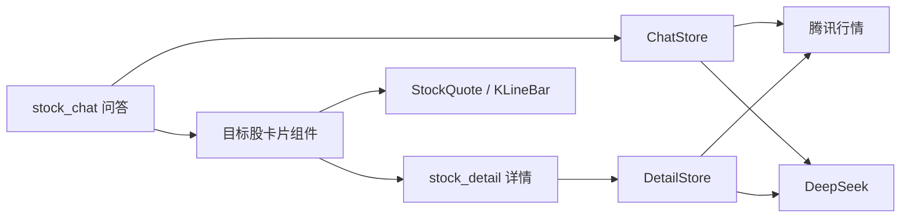

# 股票问答

Kuikly 跨端 **Task 2 · AI 股票问答应用 Demo**。

一套 Kotlin 写问答、行情卡和详情，Android / iOS / 鸿蒙 / H5 / 小程序共用 `shared`。桌面名 **股票问答**，应用内顶栏默认 **AI 投研助手**。

仓库：https://github.com/donk945/StockApplication

> 内容由 AI 生成，仅供参考，**不构成投资建议**。行情来自腾讯网页接口，可能有延迟或失败。

## 课题

| 项 | 内容 |
| --- | --- |
| 课程任务 | **Task 2**：AI 股票问答应用 Demo |
| 默认页 | `@Page("stock_chat")` |
| 详情页 | `@Page("stock_detail")` |

对照课件三条验收：

| 要求 | 本仓库实现 |
| --- | --- |
| AI 聊天主页面 | 输入、发送、停止生成、空态建议、本地历史抽屉、账号 / 设置 |
| AI 返回内容渲染 | 流式 Markdown（标题、加粗、列表）+ 目标股 / 指数行情卡 + 对比条 + 追问芯片 |
| 详情承接页 | 点卡片 `RouterModule` 打开全屏详情：分时 / 日 K、摘要、本页 AI 解读 |

额外能力（不替代 Task 2 主路径）：浅色 / 深色 / 跟随系统；设置里可覆盖 DeepSeek Key；详情长按分时或日 K，把该点带回输入框上方再提问。

## 演示

Android 真机完整链路（空态提问 → 流式 Markdown → 目标股卡片 → 详情 → 本页解读）：

[SVID_20260913_220932_1.mp4](SVID_20260913_220932_1.mp4)

<video src="SVID_20260913_220932_1.mp4" controls width="360"></video>

建议路径：打开 App → 问「宁德时代现在怎么样」→ 看流式正文与行情卡 → 点卡片进详情 → 可点「解读走势」。空态还有「上证怎么看」「光伏板块谁更强」。

## 项目简介

用户用自然语言问 A 股、常用指数或投资概念。助手先出会话标题和 Markdown 正文，再按模型给出的 `## 目标股票` / `## 目标指数` 挂上可点的行情卡。卡片只吃 `TargetStock` + `StockQuote` + 日 K，不绑死某一页；点卡打开独立 `@Page`，返回后原会话还在。

业务状态在 `ChatStore` / `DetailStore`，网络与解析在 Repository。页面只编排，卡片在 `component/chart`，方便以后抽成独立 Kit。

## 技术栈

| 项 | 版本 / 说明 |
| --- | --- |
| UI | [Kuikly](https://github.com/Tencent-TDS/KuiklyUI) Compose DSL `2.7.0-2.1.21` |
| 语言 | Kotlin 2.1.21 / KMP |
| Markdown | `kuiklybase:markdown` 0.4.0 |
| Android | minSdk 23，compileSdk 34，AGP 7.4.2 |
| AI | `https://api.deepseek.com/chat/completions`（`deepseek-chat` / `deepseek-reasoner`，SSE；失败回退一次 HTTP） |
| 行情 | `qt.gtimg.cn` / `ifzq.gtimg.cn`（非官方网页接口） |

业务 UI 写在 `shared` 的 `com.tencent.kuikly.compose.*` 上，不要用 AndroidX Compose。

## 架构说明

单 Gradle 模块 `:shared` 承载全部业务；各端只提供宿主桥（`HRBridgeModule`、`KRSseModule`、路由）。



| 层 | 职责 |
| --- | --- |
| `page/` | `@Page`、生命周期、把 Store 接到界面 |
| `state/` | `mutableState` 与业务规则，页面只读这些字段 |
| `data/` | 模型、Markdown 解析、AI / 行情 / 本地会话，无 Compose |
| `component/` | 无 `@Page`、无 toast / Repository 的可复用 UI |
| `infra/` | 宿主桥、SSE、`RouterModule` 开关页 |

问答与详情不共享 `ChatStore`。详情长按选点走进程内 `ChartAskHandoff`，回到问答页再挂到输入框上方。

分层约定见 [`shared/.../component/README.md`](shared/src/commonMain/kotlin/com/hfad/stockapplication/component/README.md)。

## 目录说明

```
androidApp/     Android 宿主（默认 stock_chat）
iosApp/         iOS 宿主
ohosApp/        鸿蒙宿主
h5App/          H5
miniApp/        微信小程序
shared/         跨端业务
buildSrc/       Kuikly 版本号、内置 Key 生成
SVID_*.mp4      Android 演示视频
```

```
shared/.../infra/           宿主桥、Page 基类、SSE、路由
shared/.../data/chat/       模型、解析、AI / 行情 / 本地仓库
shared/.../state/chat/      ChatStore
shared/.../state/detail/    DetailStore
shared/.../page/chat/       stock_chat 编排（顶栏、气泡、输入条、抽屉）
shared/.../page/detail/     stock_detail
shared/.../component/theme  配色、流式 Markdown
shared/.../component/chart  目标股卡片、对比条、分时 / 日 K
```

`page/chat` 按文件拆开：`StockChatPage` 只做 DI 与编排；`ChatTranscript` 画会话；`ChatComposerBar` 管输入。不要把 `ChatStore` 拆成多个 Store。

## 目标股票卡片：组件化与复用

课件要「AI 返回内容渲染」和「详情承接」。本仓库把 **目标股从模型文案里解析出来，再交给一组只认数据、不认页面的 Compose 组件**，而不是把卡片写死在气泡里。这是后面可以孵化成独立组件 / 上架 Kuikly 组件市场的基础。

### 数据与 UI 分开

| 层 | 类型 / 组件 | 作用 |
| --- | --- | --- |
| 模型 | `TargetStock`、`StockQuote`、`KLineBar` | 名称、6 位代码、市场前缀、现价涨跌、日 K |
| 解析 | `TargetStockParser`、`RelatedStockParser` | 从 `## 目标股票` / 关联三段抽出标的，正文里不再堆名单 |
| 卡片 | `TargetStockChip`、`ComparisonPairRow`、`QuoteSparkline` | 只吃上面的数据 + `onClick` |

卡片不知道 DeepSeek、不知道当前会话 id。换数据源或换页面，只要凑齐这几个字段就能画。

### 同一套卡片，多处复用

| 场景 | 用到的组件 |
| --- | --- |
| 问答里单只目标股 | 名称 / 代码 / 现价 / 涨跌 + `QuoteSparkline` 迷你折线，点进详情 |
| 问答里两只对比 | `ComparisonPairRow` 并排涨跌条，第三只起退回 `TargetStockChip` |
| 问答里「相关标的」 | 小芯片，复用同一套涨跌色 |
| 详情样本股 / 关联股 | 再走 `TargetStockChip`，热区 ≥ 48.dp，有代码才可点 |

入口统一：`onOpen(code)` → `RouterModule` 打开 `stock_detail`。聊天气泡和详情页是两套 `@Page`，卡片 API 相同。

### 为什么适合孵化成独立组件

1. **无页面依赖**：`component/chart` 约定不引用 `@Page`、toast、Repository，第二个业务要复用时可以直接搬走。
2. **稳定入参**：`name` / `code` / `quote` / `bars` / `onClick`，和具体模型提示词解耦。
3. **按密度组合**：完整行情卡、对比条、一行芯片是三档密度，调用方按场景拼，不必复制布局。
4. **跨端同一套**：画在 Kuikly Compose 上，Android 演示视频里的卡片与 iOS / 鸿蒙 / H5 共用源码。
5. **主题可换**：涨跌色、强调色走 `ChatComposeTheme`，浅色 / 深色不用改卡片内部。

抽独立 Kit 的门槛：第二个 feature 真的要复用，且入参已经稳定。当前仓库已经按这个边界在写，而不是把卡片和 `ChatStore` 焊在一起。

## 项目亮点

1. **页面闭环**：聊天 → 结构化卡片 → 全屏详情 `@Page`，返回会话还在。
2. **流式 Markdown**：聊天与详情解读共用增量解析；换行或累计约 40 字 parse 一次，并补全未写完的 `**` / `__`。
3. **目标股卡片可复用**：见上一节，渲染与承接页都建立在同一组组件上。
4. **图与 AI 联动**：详情长按分时 / 日 K 把该点带回输入框；提问时只把选中日交给模型，不和今日现价混在一条快照里。
5. **真实行情与模型**：腾讯报价、前复权日 K、分钟线；DeepSeek SSE。
6. **分层**：UI / Store / Repository 在 `shared`，各端只做桥。

## 环境要求

- JDK 17（Gradle 8.5）
- Android SDK（`local.properties` 里的 `sdk.dir` 已随仓库提交；路径不同时改成你本机 SDK）
- 演示用 [DeepSeek API Key](https://platform.deepseek.com/) 已写在 `local.properties` / `key.properties`
- iOS：macOS、Xcode、CocoaPods，部署目标 iOS 14.1+
- 鸿蒙：DevEco Studio，使用 `settings.ohos.gradle.kts`

## 运行 Android

1. 克隆后若本机 SDK 不在已提交路径，只改 `sdk.dir`：

```properties
sdk.dir=你的 Android SDK 路径
```

Windows 示例：`sdk.dir=C:\\Users\\你\\AppData\\Local\\Android\\Sdk`

2. Android Studio 打开根工程，运行 `androidApp`。或：

```bash
./gradlew :androidApp:assembleDebug
```

Windows 用 `gradlew.bat`。Key 来自 `local.properties`，没有时回退 `key.properties`。仍可在设置里手动填写。

## 其他端

| 端 | 说明 |
| --- | --- |
| iOS | `pod install`（`iosApp/Podfile` 引用 `../shared`），Xcode 打开 `iosApp`。编译 `shared` 时写入 `DeepSeekAPIKey.h` |
| 鸿蒙 | 以 `settings.ohos.gradle.kts` 打开，跑 `ohosApp` |
| H5 / 小程序 | Gradle 模块 `:h5App`、`:miniApp`，输出 JS 由对应宿主加载 |

各端需实现与 Android 对齐的 `HRBridgeModule`、`KRSseModule`，并支持 `RouterModule.openPage` / `closePage`。

## 安全

- `local.properties` 与 `key.properties` 已提交，公开仓库可见 Key 和本机 SDK 路径，请自行承担额度风险
- 用户在设置里保存的 Key 只写本机 SharedPreferences

## License

未指定开源协议。Kuikly / DeepSeek / 腾讯行情各自遵循其条款。
